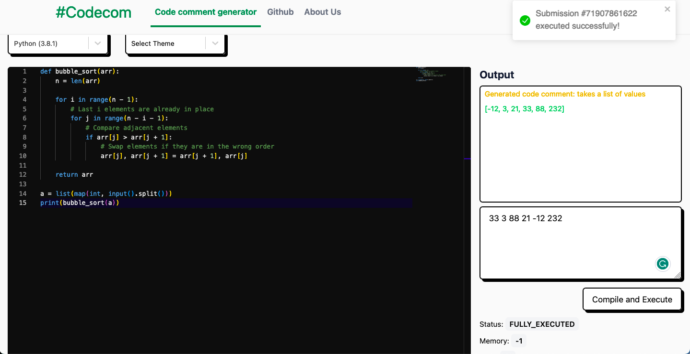

# Codcom

<!--- These are examples. See https://shields.io for others or to customize this set of shields. You might want to include dependencies, project status and licence info here --->


<!--  -->

Codcom is an AI-powered Python code editor that allows people to write Python code and compile it directly on the brower. We use a model based on Transformer architecture to predict comment for the code.

## Author

@[galin-chung-nguyen](https://github.com/galin-chung-nguyen)
@[lengocduc195khtn](https://github.com/lengocduc195khtn)

## Technology stack
- AI Mode: microsoft/codebert-base (model config), deepset/roberta-base-squad2 and stsb-roberta-
base (tokenizers), cross-encoder/stsb-roberta-base (cross encoder to evaluate generated sentence similarity)
- Front-end: NextJS, Redux, TailwindCSS
- Back-end: Flask (API), Transformer/Tensorflow/Pytorch/... (modules for prediction)

## Live demo

Not available yet.



## Test Codcom

1. Install node, yarn and dependencies of the project (```yarn install```)
2. Install python3 and modules in back-end/requirements.txt
3. Download checkpoint file model-batch-16.pt (drive ID: 1_V972LTW7wQ1IQm7neCc9oKMnC_do7rw) and put it in back-end/api
4. Create .env to setup back-end endpoint, for example:
```BACK_END_ENDPOINT = "http://127.0.0.1:3001"```
4. Run both back-end and front-end: yarn start
5. Go to [http://localhost:3000](http://localhost:3000) (front-end) to test the app, the back-end is [http://localhost:3001](http://localhost:3001)

## Contact

If you want to contact me you can reach me at [Linkedin](https://www.linkedin.com/in/galin-chung-nguyen/)

### **Have a good day!**
